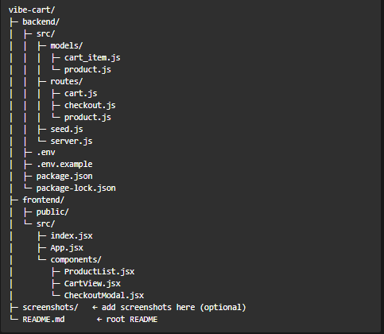
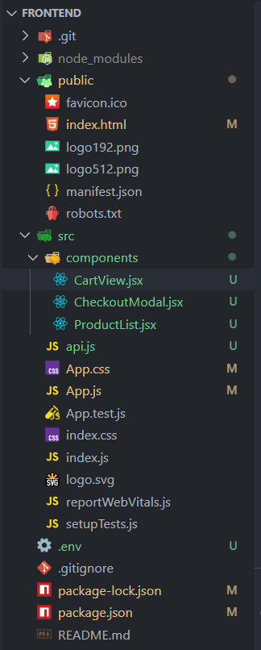
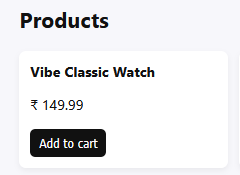
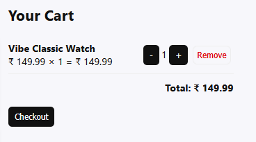
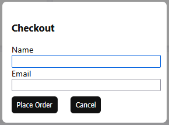
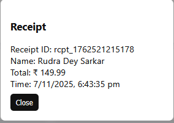

# Vibe Cart

> This readme containing the entire project structure (frontend + backend)

---

#### Vibe cart project structure



#### Vibe Cart — Mock E‑Com Cart

A small full‑stack shopping cart app (React frontend + Node/Express backend + MongoDB). This repo contains two folders: `/backend` and `/frontend`.

#### What’s included

* `backend/` — Express API, Mongoose models, seed script.
* `frontend/` — React app (simple setup) with product list, cart view, checkout modal.

# **Quick start**

## Frontend

**Frontend folder structure**



**Commands to setup and start the frontend**

```
cd frontend
npm install
npm start
```

**Environment** (`.env` — create from `.env.example`)

```
BACKEND_API_URL=http://localhost:5000/api
```

**Responsive & behaviour details**

* Products show `Add to cart` button.

  
* Cart lists items with quantity controls and `Remove` and `Checkout` button.

  
* Checkout form collects `name` and `email` and shows a receipt modal after successful checkout.

  

  
